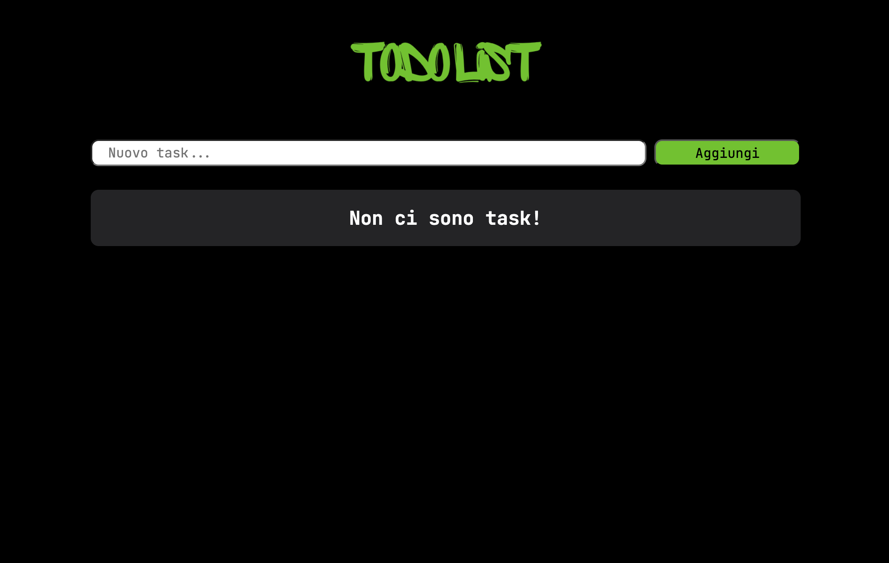

# TodoList Vue.js App

Questo progetto è un'applicazione TodoList sviluppata utilizzando Vue.js. Consente agli utenti di aggiungere, completare e rimuovere task dalla lista delle attività da svolgere.

## Funzionalità Principali

- **Aggiunta di Nuovi Task**: Gli utenti possono inserire una nuova descrizione di task nel campo di input e aggiungerla premendo il pulsante "Aggiungi" o premendo il tasto "Invio" sulla tastiera. Il sistema esegue automaticamente un controllo per garantire che il task inserito abbia almeno 5 caratteri di testo significativo, ignorando gli spazi vuoti all'inizio.
  
- **Completamento di Task**: Ciascun task può essere contrassegnato come completato facendo clic sull'icona di spunta accanto ad esso. Questo cambierà lo stile visivo del task per indicare che è stato completato.

- **Rimozione di Task**: Gli utenti possono rimuovere un task dalla lista facendo clic sull'icona "X" accanto ad esso.

- **Feedback degli Errori**: Se l'utente cerca di aggiungere un task troppo corto (meno di 5 caratteri di testo significativo), verrà visualizzato un messaggio di errore per informarlo della lunghezza minima richiesta.

## Tecnologie Utilizzate

- Vue.js: Framework JavaScript importato tramite CDN per la creazione di interfacce utente reattive e dinamiche.
- Font Awesome: Libreria di icone vettoriali utilizzata per gli elementi grafici nell'applicativo.
- Google Fonts: Font utilizzati nell'interfaccia dell'applicazione.
